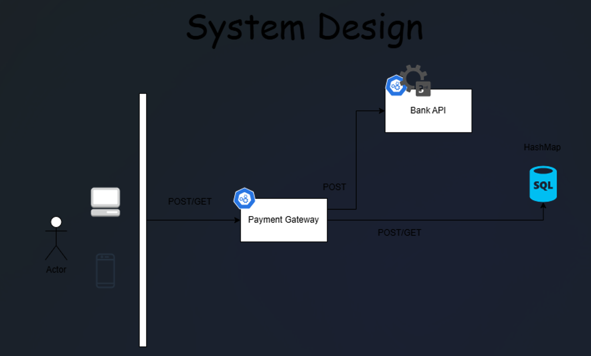

# Documentation

## Overview
This project is a Payment Gateway that processes and manages card payments, interfacing with a bank API using RestTemplate to authorize or decline transactions. It provides basic functionality to submit payments and retrieve payment details using UUIDs. The application ensures security, handles exceptions, and validates the correctness of input data.

## Requirements
The product requirements for this initial phase are the following:

- A merchant should be able to process a payment through the payment gateway and receive one of the following types of response:
  - **Authorized** - the payment was authorized by the call to the acquiring bank
  - **Declined** - the payment was declined by the call to the acquiring bank
  - **Rejected** - No payment could be created as invalid information was supplied to the payment gateway, and therefore it has rejected the request without calling the acquiring bank
- A merchant should be able to retrieve the details of a previously made payment

## System Design

## Design Considerations

1. **Security**:
  - Sensitive payment details (e.g., full card number, CVV) are never logged or exposed in responses.
  - Input data is validated to prevent malformed or unauthorized requests.

2. **Data Validation**:
  - Expiry dates are validated to ensure that the card is not expired.
  - Currency codes must follow the ISO 4217 standard.
  - Card number length and format, along with CVV, are checked for validity.

3. **Error Handling**:
  - Meaningful exceptions are thrown and logged when issues arise, such as invalid payment data or failed communication with the bank.
  - Appropriate HTTP status codes (400 for bad requests, 404 for missing resources, 500 for server errors) are returned to clients for clarity.

4.  **Logging**:
   - Logging is implemented for important operations, including payment submissions, bank responses, and errors.
   - Different log levels (INFO for successful operations, WARN for declined payments, and ERROR for failures) are used to distinguish between event types.

5. **UUID for Traceability**:
  - Each payment transaction is assigned a UUID for tracking and debugging purposes.
  - This allows for easy retrieval and investigation of individual transactions.

6. **Separation of Concerns**:
  - Payment processing logic is separated from exception handling and external bank communication.
  - Models are used for request and response objects, maintaining clear boundaries between different parts of the system.

## Assumptions Made:

### Bank API Availability:

- The bank is represented as the simulator that provides responses based on a set of known test cards, each of which return a specific response so that successful authorizations and declines can be tested.
- It is assumed that the bank’s payment system is available and operational when sending payment requests. If the bank’s system is down, a server error is returned to the user.

### Valid Card Information:

It is assumed that the payment details provided by the user (such as the card number, CVV, and expiry date) are valid, except when explicitly checked (like for expired cards or incorrect formats). Things like whether the card is actually active or has sufficient funds is not validated – that’s handled by the bank.

### Security of Sensitive Data:

It is assumed that the card information is handled securely and complies with industry standards (like PCI-DSS) for payment processing. Sensitive data like CVV or full card numbers are never logged or exposed in the system.

### Currency Support:

The API assumes that the supported currencies are ISO 4217 compliant, and any invalid currency code will result in an error response. Currently supported by the system: EUR, USD, GBP.

### Payment Authorization:

It is assumed that if the bank’s response indicates the payment is authorized, it is indeed valid. If the bank declines the payment, it is assumed the payment cannot proceed.

### Simple Error Handling:

It is assumed that errors will be handled in a straightforward manner: for example, if a payment is declined, we return a DECLINED status, and if there's a system error, we return an appropriate status based on the reason.

### Payment Transactions Storage:

It is assumed that there is no integration with a real storage engine (database). The test double repository is used to mimic this behavior.

## Swagger API Documentation

For documentation of API the **Swagger Contract** is generated, and it can be found under the following url: **http://localhost:8090/swagger-ui/index.html**
